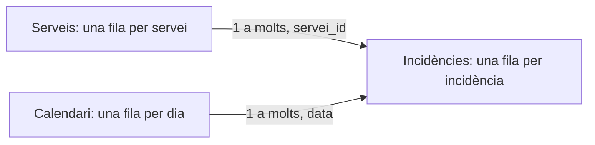

# 10 · Dashboards i modelatge amb Power BI

[← Índex de les píndoles](../index.md)

!!! abstract "Què aprendràs"
    - Definir indicadors amb numerador i denominador.
    - Relacionar fets i dimensions i crear mesures.
    - Verificar filtres, totals i comunicació de resultats.

**Coneixements previs:** Granularitat, agrupacions i gràfics; accés a Power BI Desktop per a la part visual.

**Dedicació orientativa:** 4–5 h per a lectura i laboratori guiat; les extensions i els exercicis autònoms requerixen temps addicional.

!!! tip "Dos recorreguts possibles"
    **Essencial:** llig els fonaments, executa el laboratori i completa la pràctica inicial. **Aprofundiment:** continua amb les pràctiques intermèdia i avançada i els exercicis. El professorat pot seleccionar-les segons els coneixements previs; no són totes obligatòries dins del projecte.

## Mapa de la unitat

Un quadre de comandament comença amb una decisió → Granularitat i model de dades → Preparació amb Power Query → Columnes calculades i mesures → Context de filtre → Temps, comparacions i prediccions → Disseny i accessibilitat → Verificació i distribució

## 1. Un quadre de comandament comença amb una decisió

Un dashboard reunix indicadors i filtres per respondre preguntes recurrents. El primer treball és determinar qui el consultarà, quina decisió prendrà i quina periodicitat necessita. Un informe per explorar causes pot requerir més detall que una pantalla per detectar incidències del dia.

Escriu tres preguntes abans de triar gràfics. Per exemple: quantes incidències tenim, quant de temps consumixen i quina proporció està resolta? A continuació, definix numerador, denominador, unitat, període i font de cada indicador.

«Temps mitjà» és ambigu si no sabem si inclou incidències obertes, temps d’espera o només treball actiu. Una definició visible evita que dos equips interpreten la mateixa targeta de manera diferent.

## 2. Granularitat i model de dades

La granularitat indica què representa una fila. En el laboratori, una fila d’`incidencies.csv` representa una incidència; una fila de `serveis.csv`, un servei. La primera és una taula de fets amb mesures i claus; la segona és una dimensió que descriu una entitat.

Un esquema en estrela connecta dimensions amb fets. La clau del costat «u» ha de ser única. Si el catàleg conté dues files del mateix servei, no s’ha de forçar una relació sense entendre què representen.



Una relació no és una fusió física de totes les columnes. Propaga filtres segons la seua direcció i configuració. Per començar, utilitza dimensions que filtren fets en una sola direcció; la bidireccionalitat pot introduir ambigüitat i necessita una raó concreta.

No mescles vendes mensuals i clients individuals com si tingueren la mateixa granularitat. Una unió mal definida pot multiplicar imports i produir totals aparentment plausibles.

## 3. Preparació amb Power Query

Importa els dos CSV generats pel laboratori. Revisa el delimitador, la codificació i els tipus abans de carregar. `servei_id`, `id`, `minuts` i `resolt` són enters; `data` és una data; `servei` és text.

En dades externes, la configuració regional pot afectar dates i decimals. Una data amb dia i mes intercanviables no és una prova suficient: verifica també un valor que no admeta les dues lectures. Conserva els passos de transformació perquè el procés siga repetible.

Diferencia neteja de modelatge. Corregir espais en un nom és una transformació de text. Decidir si una incidència oberta entra en una taxa és una definició de negoci. Documenta les dues, però no amagues la segona dins d’un filtre poc visible.

Comprova nombre de files, claus úniques, nuls i totals abans i després d’una transformació. El laboratori és menut perquè es puga contrastar a mà abans de treballar amb milers de registres.

## 4. Columnes calculades i mesures

Una columna calculada produïx un valor per fila i es conserva en el model. Una mesura s’avalua quan es consulta, dins del context de filtres de la visualització. Per a totals i taxes interactives, normalment necessitem mesures.

Suposant que les taules importades es diuen `Incidencies` i `Serveis`, crea cada expressió com una mesura independent:

```dax title="Mesures bàsiques"
Nombre incidencies = COUNTROWS(Incidencies)
```
```dax
Minuts totals = SUM(Incidencies[minuts])
```
```dax
Temps mitja = DIVIDE([Minuts totals], [Nombre incidencies])
```
```dax
Resoltes = SUM(Incidencies[resolt])
```
```dax
Taxa resolucio = DIVIDE([Resoltes], [Nombre incidencies])
```

`resolt` està codificat com 0 o 1; per això sumar-lo equival a comptar les resoltes. Si les dades usen text o hi ha valors absents, esta equivalència s’ha de revisar. Formata la taxa com a percentatge; no multipliques també per 100 si el format ja ho fa.

`DIVIDE` permet gestionar denominadors nuls o zero. Una absència de dades no sempre significa zero: mostrar un blanc pot ser més honest que afirmar que la taxa és 0%.

## 5. Context de filtre

Una targeta sense filtres considera totes les incidències visibles. Si seleccionem el servei Web, les mesures han de considerar només les dues incidències d’eixe servei. La fórmula és la mateixa; el context és diferent.

| Context | Incidències | Minuts totals | Temps mitjà | Taxa resolució |
|---|---:|---:|---:|---:|
| Tot | 4 | 200 | 50 | 75% |
| Web | 2 | 60 | 30 | 50% |
| Correu | 2 | 140 | 70 | 100% |

Una mitjana de mitjanes pot donar un resultat incorrecte quan els grups tenen mides diferents. Per agregar, conserva numeradors i denominadors i torna a calcular la taxa. En este exemple els dos grups tenen igual mida, però no és una propietat general.

`CALCULATE` modifica el context. Per exemple, una mesura restringida a Web pot usar `CALCULATE([Nombre incidencies], Serveis[servei] = "Web")`. Cal provar què passa si el lector selecciona Correu: un filtre explícit sobre la mateixa columna pot substituir-ne l’existent. No introduïsques mesures així sense explicar l’efecte esperat.

## 6. Temps, comparacions i prediccions

Una dimensió de calendari amb dates úniques i contínues facilita comparacions temporals. La comparació «mes anterior» necessita definir si comparem mesos complets o un mes parcial amb un de complet. Una diferència pot reflectir simplement més dies d’observació.

En un dashboard predictiu, separa visualment observacions i estimacions. Mostra data de tall, horitzó, unitat i model o versió. Una línia contínua que unix dades reals i prediccions sense llegenda pot fer creure que tot ha passat.

Si hi ha intervals, explica què representen i com s’han obtingut. Una banda dibuixada arbitràriament al voltant d’una predicció no és una estimació d’incertesa. Si no disposem d’intervals validats, comunica la limitació.

## 7. Disseny i accessibilitat

Organitza la pàgina segons les preguntes. Les targetes poden mostrar volum, temps i taxa; un gràfic de barres permet comparar serveis; una taula ajuda a comprovar valors. No cal omplir tots els espais amb visuals.

Usa títols que expliquen unitat i període, colors consistents i contrast suficient. Evita transmetre l’estat només amb roig i verd: afegix text, símbols o etiquetes. Ordena les categories amb un criteri útil i revisa que els filtres actius siguen visibles.

Una pantalla ha de permetre distingir ràpidament una absència de dades, un valor zero i un resultat filtrat. Inclou una nota breu amb definicions i actualització. Prova l’informe com si fores una persona que no ha participat en la seua construcció.

## 8. Verificació i distribució

Abans de compartir, contrasta les cinc mesures amb els controls del laboratori, aplica filtres combinats i torna a l’estat inicial. Revisa també el comportament d’una selecció sense registres.

Power BI Desktop és l’entorn previst per a la pràctica visual. Els CSV i els controls Python es poden generar en altres sistemes; la construcció de l’informe requerix un entorn compatible amb Desktop. Les opcions de publicació i compartició depenen de l’entorn i les llicències del centre: esta píndola no pressuposa una modalitat concreta.

En esta píndola s’han executat el generador de dades i els controls numèrics. Les mesures i les interaccions s’han de verificar en Power BI Desktop durant la pràctica; no es presenta un fitxer PBIX ja validat.

## Laboratori complet i reproduïble

**Context:** treballarem amb dades sintètiques creades pel mateix programa. No cal descarregar datasets ni usar els CSV de BiciTierra. Els valors servixen per aprendre i comprovar procediments; no descriuen una població real.

**Materials:** Python 3.10 o superior, un entorn virtual i els [requisits de la unitat](requirements.txt). Consulta la [preparació comuna](../index.md) abans d’instal·lar-los.

Des de la carpeta d’esta píndola, amb l’entorn activat:

```bash
python -m pip install -r requirements.txt
python codi/exemple.py
```

El programa crea `codi/eixides/`. Pots examinar les eixides sense modificar el codi original. Per resoldre les variants, treballa sobre una còpia i actualitza les comprovacions quan canvies deliberadament les dades.

### Exemple comentat

[Obri o descarrega el programa complet](codi/exemple.py). Cada comprovació `assert` expressa una propietat esperada de les dades de demostració; si falla, investiga la causa abans d’eliminar-la.

```python title="codi/exemple.py" linenums="1"
"""Dades menudes d'un servei tècnic i totals per comprovar manualment Power BI."""
from pathlib import Path
import pandas as pd

def main():
    out = Path(__file__).resolve().parent / 'eixides'
    out.mkdir(exist_ok=True)
    # Una fila representa una incidència: esta és la granularitat.
    facts = pd.DataFrame({'id': [1, 2, 3, 4], 'data': ['2026-01-01', '2026-01-02', '2026-02-01', '2026-02-02'], 'servei_id': [1, 1, 2, 2], 'minuts': [20, 40, 60, 80], 'resolt': [1, 0, 1, 1]})
    # El catàleg té una clau única per servei.
    dim = pd.DataFrame({'servei_id': [1, 2], 'servei': ['Web', 'Correu']})
    facts.to_csv(out / 'incidencies.csv', index=False)
    dim.to_csv(out / 'serveis.csv', index=False)
    # Els totals menuts permeten contrastar després el dashboard a mà.
    assert facts.id.nunique() == 4 and facts.minuts.sum() == 200
    print('Controls esperats: 4 incidències; 200 minuts; mitjana 50; resolució 75%.')
    print('Filtre Web: 2 incidències; 60 minuts; mitjana 30; resolució 50%.')
    print('Filtre Correu: 2 incidències; 140 minuts; mitjana 70; resolució 100%.')
if __name__ == '__main__':
    main()
```

## Pràctiques guiades

Cada pràctica deixa una evidència petita: una eixida comprovada i una explicació de la decisió. Els temps són orientatius i no inclouen instal·lació.

### Pràctica 1 · Importar i relacionar

**Nivell i temps:** Inicial · 20–30 min.

**Objectiu:** Construir un model menut que es puga comprovar manualment.

**Materials:** exemple comentat d’esta unitat, les seues eixides i una còpia de treball per a les modificacions.

**Procediment:**

1. Executa el generador i importa els dos CSV en Power BI Desktop.
2. Anomena les taules `Incidencies` i `Serveis` i revisa els tipus de dades.
3. Crea la relació de Serveis a Incidencies per `servei_id`, d’u a molts i amb filtre en una direcció.
4. Mostra en una taula servei i nombre d’incidències i contrasta els recomptes amb els CSV.

!!! success "Comprovació i evidència esperada"
    Hi ha dos serveis únics i quatre incidències; cada servei en té dues.

**Preguntes de reflexió:**

- Per què `servei_id` ha de ser únic en la dimensió?
- Què representa una fila de fets?
- Quin símptoma podria indicar una relació incorrecta?

**Ampliació opcional:** Introduïx deliberadament una clau de servei desconeguda en una còpia de dades i observa com es manifesta.

### Pràctica 2 · Mesures que respecten filtres

**Nivell i temps:** Intermèdia · 30–45 min.

**Objectiu:** Verificar numeradors, denominadors i context.

**Materials:** exemple comentat d’esta unitat, les seues eixides i una còpia de treball per a les modificacions.

**Procediment:**

1. Crea les cinc mesures DAX de la teoria, una per una.
2. Afig targetes amb recompte, minuts, mitjana i taxa de resolució.
3. Afig un segmentador de servei i comprova successivament Tot, Web i Correu.
4. Registra els resultats en una taula i compara’ls amb els nou valors de recompte, minuts i mitjana i les tres taxes de control.

!!! success "Comprovació i evidència esperada"
    Els totals són 4, 200, 50 i 75%; els filtres Web i Correu donen exactament els controls de la teoria.

**Preguntes de reflexió:**

- Per què la taxa és una mesura i no la mitjana de percentatges ja agregats?
- Què hauria de mostrar una selecció sense dades?
- Què passaria si `resolt` continguera valors diferents de 0 i 1?

**Ampliació opcional:** Afig un tercer servei amb una sola incidència i comprova per què la mitjana simple de mitjanes deixa de ser correcta.

### Pràctica 3 · Dissenyar una pàgina per prendre decisions

**Nivell i temps:** Avançada · 45–60 min.

**Objectiu:** Comunicar indicadors amb definicions i filtres visibles.

**Materials:** exemple comentat d’esta unitat, les seues eixides i una còpia de treball per a les modificacions.

**Procediment:**

1. Organitza una pàgina amb les quatre targetes, barres de minuts per servei i una taula de detall.
2. Afig títol, període, nota de dades sintètiques i definició del temps mesurat.
3. Prova interaccions seleccionant una barra i després netejant filtres.
4. Demana a una altra persona que responga les tres preguntes inicials sense explicacions orals i anota els dubtes.

!!! success "Comprovació i evidència esperada"
    Els controls numèrics continuen passant i la pàgina permet identificar filtres actius i unitats.

**Preguntes de reflexió:**

- Quin visual aporta una informació diferent de les targetes?
- Com distingiries dades observades i estimades en una ampliació?
- Què milloraries després de la prova amb una altra persona?

**Ampliació opcional:** Afig una pàgina de definicions i un calendari per a una ampliació temporal amb més observacions.

## Exercicis autònoms

Intenta resoldre cada repte abans de desplegar l’orientació. Es valora el raonament i les comprovacions, no només obtindre una xifra.

### Repte 1 · Mitjana de mitjanes

Un servei té una incidència de 100 minuts i un altre nou incidències de 10. Calcula el temps mitjà global.

??? example "Solució orientativa i criteri de revisió"
    El total és 190 minuts entre 10 incidències: 19 minuts. Fer la mitjana de 100 i 10 dóna 55 i és incorrecte per al conjunt.

### Repte 2 · Taxa amb filtre

Dissenya una comprovació per detectar que un segmentador no afecta les targetes.

??? example "Solució orientativa i criteri de revisió"
    Selecciona un servei amb valors coneguts i contrasta amb la taula de control. Revisa relació, direcció i interaccions visuals abans de modificar fórmules a l’atzar.

### Repte 3 · Predicció visible

Esbossa una visual que combine sis mesos observats i dos previstos.

??? example "Solució orientativa i criteri de revisió"
    Diferencia sèries amb estil i llegenda, marca la data de tall i indica horitzó i unitats. Si no hi ha intervals validats, no inventes una banda d’incertesa.

## Errors habituals i diagnòstic

| Símptoma | Causa que convé investigar | Comprovació o correcció |
|---|---|---|
| Totals multiplicats | Granularitat o relació incorrecta. | Comprova claus i una taula petita manualment. |
| Segmentador sense efecte | Relació o interacció no configurada. | Verifica direcció de filtre i interaccions visuals. |
| Taxa multiplicada per cent dues vegades | Fórmula i format percentual superposats. | Retorna una proporció i aplica format percentatge. |

## Autoavaluació i evidències

Abans de donar la unitat per treballada, comprova estos punts i escriu una frase d’evidència per a cadascun:

- [ ] Puc definir indicadors amb numerador i denominador.
- [ ] Puc relacionar fets i dimensions i crear mesures.
- [ ] Puc verificar filtres, totals i comunicació de resultats.
- [ ] He executat el laboratori i he contrastat almenys un resultat independentment.
- [ ] Puc explicar una limitació i un cas en què el procediment requeriria canvis.

**Lliurable de la píndola:** còpia de treball reproduïble, resultats de la pràctica seleccionada i un text breu que indique pregunta, decisió, comprovació i limitació. Si s’usa dins de BiciTierra Market, integra esta evidència en el lliurable setmanal corresponent; no cal crear una entrega duplicada.

## Fonts per aprofundir

- [Documentació oficial de referència](https://learn.microsoft.com/en-us/power-bi/guidance/star-schema). Consulta especialment els conceptes i els supòsits descrits en la unitat.
- [Opcions de càlcul en Power BI](https://learn.microsoft.com/en-us/power-bi/transform-model/desktop-calculations-options).

Les versions executades i els límits de la comprovació estan en el [registre de validació](../VALIDACIO.md). Els exemples són originals i les dades són sintètiques.

## Aplicació final a BiciTierra Market

**Moment orientatiu:** setmana 6. Esta correspondència ajuda a triar materials i no substituïx el document de treball de l’alumnat.

Presenta indicadors observats, perfils i prediccions amb granularitat clara. Marca el mes de tall i l’horitzó de previsió; no sumes dades de clients i vendes com si representaren la mateixa unitat. Contrasta totals amb els CSV abans de dissenyar la pantalla final.

**Transferència:** identifica quin concepte acabes de practicar, quina dada del projecte l’exigix i què has de canviar respecte del laboratori. Justifica eixa adaptació abans de copiar codi.
