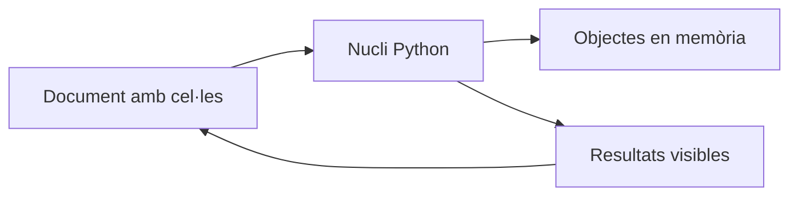

# 02 · Jupyter: notebooks que es poden reproduir

[← Índex de les píndoles](../index.md)

!!! abstract "Què aprendràs"
    - Combinar pregunta, codi, resultat i interpretació.
    - Detectar dependències d’un estat ocult del nucli.
    - Executar un notebook complet des de zero.

**Coneixements previs:** Python bàsic, llistes, funcions i rutes.

**Dedicació orientativa:** 2–3 h per a lectura i laboratori guiat; les extensions i els exercicis autònoms requerixen temps addicional.

!!! tip "Dos recorreguts possibles"
    **Essencial:** llig els fonaments, executa el laboratori i completa la pràctica inicial. **Aprofundiment:** continua amb les pràctiques intermèdia i avançada i els exercicis. El professorat pot seleccionar-les segons els coneixements previs; no són totes obligatòries dins del projecte.

## Mapa de la unitat

Un document que també s’executa → Cel·les de codi i cel·les de text → L’ordre visual i l’ordre real → L’intèrpret del terminal pot ser diferent → Rutes, dades i eixides → De l’experiment a un informe verificable → Lectura crítica i col·laboració

## 1. Un document que també s’executa

Un notebook combina text, codi i resultats en una seqüència de cel·les. És útil per investigar una pregunta perquè permet documentar hipòtesis al costat de les operacions i de les evidències. No obstant això, l’aparença d’un informe acabat no garanteix que el codi es puga tornar a executar.

El fitxer `.ipynb` emmagatzema una estructura JSON: cel·les, metadades i, sovint, eixides anteriors. El **nucli** o *kernel* és el procés que executa el llenguatge i manté les variables en memòria. La interfície del navegador és una altra peça. Tancar una pestanya i reiniciar el nucli no són la mateixa operació.



## 2. Cel·les de codi i cel·les de text

Una cel·la de codi calcula. Una cel·la Markdown explica la pregunta, el procediment o la interpretació. Escriure «ací fem un groupby» repetix el codi; explicar «comparem temps per servei perquè el volum pot ocultar un equip saturat» documenta el criteri.

Un notebook llegible té una pregunta inicial, les dades i dependències, una exploració, unes decisions i una conclusió. Les eixides s’han de seleccionar: centenars de files impreses dificulten trobar el resultat important. Mostra resums, casos representatius i recomptes de control.

```python title="Una cel·la amb una evidència menuda"
litres = [110, 125, 100, 140, 125]
mitjana = sum(litres) / len(litres)
print(f"Consum mitjà: {mitjana:.1f} litres/dia")
```

La interpretació és que esta mostra té una mitjana de 120 litres. No podem afirmar que siga el consum habitual d’un any, perquè només tenim cinc dies. Una conclusió correcta inclou el límit del que s’ha observat.

## 3. L’ordre visual i l’ordre real

Suposa que una cel·la definix `factor = 2` i una altra calcula `10 * factor`. Si executes la segona després d’haver canviat el factor a 3 en una cel·la eliminada, el resultat pot mostrar 30 encara que el document visible suggerisca 20.

Els comptadors d’execució ajuden a detectar salts, però no són una prova completa. La comprovació més útil és reiniciar el nucli i executar totes les cel·les des de dalt. Si falla, hi ha dependències ocultes, fitxers no disponibles o una seqüència incorrecta.

!!! warning "Guardar no equival a reproduir"
    Un resultat antic pot continuar visible encara que el codi haja canviat. Després de modificar el procediment, torna a executar des d’un estat net abans d’interpretar o entregar.

No es resol esta situació amb més variables globals. Organitza transformacions en funcions i usa noms que distingisquen dades originals, preparades i resultats. Evita modificar el mateix DataFrame moltes vegades sense saber quina versió conté.

## 4. L’intèrpret del terminal pot ser diferent

El terminal i el nucli poden usar entorns diferents. La prova directa dins del notebook és:

```python title="Identificar el nucli i la carpeta actual"
import sys
from pathlib import Path

print(sys.executable)
print(Path.cwd())
```

Si falta una biblioteca, identifica el nucli abans d’instal·lar-la. La màgia `%pip` de l’entorn IPython està dissenyada per operar en l’entorn del nucli, però també cal comprovar si es requerix reiniciar-lo. Les ordres que comencen amb `!` executen una ordre de sistema; no són Python portàtil fora del notebook.

Per registrar explícitament un entorn com a nucli, es pot usar `python -m ipykernel install --user --name nom-del-projecte --display-name "Python del projecte"` des d’eixe entorn. El nom visible és una ajuda, però la comprovació definitiva continua sent `sys.executable`.

## 5. Rutes, dades i eixides

Un notebook ha de declarar des d’on llig. Amb `Path('../dades')`, la ruta depén del directori de treball i no d’una intuïció sobre on està la pestanya. Abans d’analitzar un CSV, comprova que existeix i que correspon a la versió esperada.

Una ruta absoluta de la màquina de l’autor fa el material poc portàtil. Una estructura de carpetes compartida i rutes relatives explícites acostumen a ser més útils. Quan el projecte creix, afegix una configuració clara de la ruta base.

Els gràfics, mètriques i exports són eixides derivades. No substituïsques el fitxer original de dades amb una transformació de prova. Separar entrades i resultats permet repetir l’anàlisi i contrastar què ha canviat.

## 6. De l’experiment a un informe verificable

La reproducció té diferents nivells. Reexecutar sense errors comprova dependències bàsiques. Obtindre les mateixes mètriques també pot requerir fixar llavors i versions. Obtindre una conclusió robusta exigix, a més, una mostra adequada i un procediment d’avaluació coherent.

| Situació | Què s’ha de comprovar |
|---|---|
| `NameError` després de reiniciar | La variable es definix en una cel·la anterior visible? |
| Un import funciona només al terminal | És el mateix intèrpret? |
| Resultats diferents cada vegada | Hi ha aleatorietat, dades canviants o dependència d’estat? |
| Notebook molt lent o enorme | S’imprimixen massa dades o es repetixen càlculs costosos? |
| Un gràfic no concorda amb la taula | Corresponen a la mateixa execució i a les mateixes dades? |

El programa de laboratori crea un notebook amb una pregunta sobre consum d’aigua i l’executa amb `nbclient`, una biblioteca per a l’execució programàtica. Això permet comprovar la seqüència sense fer clic manualment. La verificació conté també una asserció del resultat esperat: executar-se no és suficient si el càlcul és incorrecte.

Un notebook és especialment adequat per a exploració i explicació. Una tasca programada, un servei web o un procés llarg sol necessitar funcions i mòduls executables. El pas habitual és extraure la lògica estable a un script i conservar el notebook com a anàlisi i documentació.

## 7. Lectura crítica i col·laboració

Abans de compartir, revisa si les eixides mostren dades personals, claus o camins interns. Un fitxer de confiança pot contindre codi que accedisca a recursos de la màquina: llig les cel·les abans d’executar material que no coneixes. La marca de confiança de la interfície no és una auditoria del programa.

En treball en equip, assignar cada persona a una cel·la pot generar un document incoherent. És millor acordar les entrades, les funcions, els noms de les dades i una persona que comprove l’execució completa. El relat ha de correspondre al que el codi fa, no al que l’equip pretenia fer.

Una revisió útil pot seguir tres preguntes: quin resultat es vol demostrar, quines dades l’avalen i què passaria si s’executara tot en una màquina nova? Estes preguntes són igualment vàlides en un informe de laboratori, una anàlisi de serveis o una investigació estadística.

## Laboratori complet i reproduïble

**Context:** treballarem amb dades sintètiques creades pel mateix programa. No cal descarregar datasets ni usar els CSV de BiciTierra. Els valors servixen per aprendre i comprovar procediments; no descriuen una població real.

**Materials:** Python 3.10 o superior, un entorn virtual i els [requisits de la unitat](requirements.txt). Consulta la [preparació comuna](../index.md) abans d’instal·lar-los.

Des de la carpeta d’esta píndola, amb l’entorn activat:

```bash
python -m pip install -r requirements.txt
python codi/exemple.py
```

Per obrir els notebooks generats amb la interfície opcional: `python -m notebook`. Selecciona el nucli del mateix entorn. El generador executa també una còpia des d’un nucli nou.

El programa crea `codi/eixides/`. Pots examinar les eixides sense modificar el codi original. Per resoldre les variants, treballa sobre una còpia i actualitza les comprovacions quan canvies deliberadament les dades.

### Exemple comentat

[Obri o descarrega el programa complet](codi/exemple.py). Cada comprovació `assert` expressa una propietat esperada de les dades de demostració; si falla, investiga la causa abans d’eliminar-la.

```python title="codi/exemple.py" linenums="1"
"""Crea un notebook menut i comprova l'execució des d'un nucli nou."""
from pathlib import Path
import nbformat
from nbclient import NotebookClient

def main():
    out = Path(__file__).resolve().parent / 'eixides'
    out.mkdir(exist_ok=True)
    # El notebook conté tant la pregunta com el càlcul i la interpretació.
    nb = nbformat.v4.new_notebook(cells=[nbformat.v4.new_markdown_cell("# Consum d'aigua\nDades sintètiques. Pregunta: quin consum mitjà tenen cinc dies?"), nbformat.v4.new_code_cell("litres = [110, 125, 100, 140, 125]\nassert all(x >= 0 for x in litres)\nprint('Dies:', len(litres))"), nbformat.v4.new_code_cell("mitjana = sum(litres) / len(litres)\nprint('Mitjana:', mitjana)\nassert mitjana == 120"), nbformat.v4.new_markdown_cell("## Interpretació\nLa mitjana és de 120 litres/dia. Cinc dies no permeten estimar l'estacionalitat anual.")])
    nb.metadata['kernelspec'] = {'display_name': 'Python 3', 'language': 'python', 'name': 'python3'}
    nbformat.write(nb, out / 'aigua.ipynb')
    # Un nucli nou evita dependre de variables d’una sessió anterior.
    executed = NotebookClient(nb, timeout=60, kernel_name='python3', resources={'metadata': {'path': str(out)}}).execute()
    nbformat.write(executed, out / 'aigua-executat.ipynb')
    assert all((c.get('execution_count') is not None for c in executed.cells if c.cell_type == 'code'))
    print('Notebook creat i executat des de zero: mitjana 120 litres/dia')
if __name__ == '__main__':
    main()
```

## Pràctiques guiades

Cada pràctica deixa una evidència petita: una eixida comprovada i una explicació de la decisió. Els temps són orientatius i no inclouen instal·lació.

### Pràctica 1 · Llegir un notebook com un argument

**Nivell i temps:** Inicial · 20–30 min.

**Objectiu:** Relacionar cada cel·la amb una pregunta, un càlcul o una interpretació.

**Materials:** exemple comentat d’esta unitat, les seues eixides i una còpia de treball per a les modificacions.

**Procediment:**

1. Executa el generador i obri `codi/eixides/aigua.ipynb` en Jupyter.
2. Classifica les quatre cel·les segons la seua funció: context, preparació, càlcul i conclusió.
3. Executa-les en ordre i compara el resultat amb `aigua-executat.ipynb`.
4. Afig una cel·la Markdown amb les unitats, la procedència sintètica i la limitació dels cinc dies observats.

!!! success "Comprovació i evidència esperada"
    Les dues cel·les de codi tenen eixida i la mitjana és 120 litres/dia; el relat no promet una predicció anual.

**Preguntes de reflexió:**

- Per què una eixida guardada no demostra que el codi actual funcione?
- Quina informació aporta Markdown que no aporta un comentari breu?
- Quina conclusió excediria les dades disponibles?

**Ampliació opcional:** Canvia el títol perquè expresse la pregunta concreta i no només el nom de l’eina.

### Pràctica 2 · Fer visible l’estat ocult

**Nivell i temps:** Intermèdia · 30–45 min.

**Objectiu:** Experimentar amb l’ordre d’execució i corregir dependències invisibles.

**Materials:** exemple comentat d’esta unitat, les seues eixides i una còpia de treball per a les modificacions.

**Procediment:**

1. Fes una còpia del notebook i executa totes les cel·les una vegada.
2. Canvia temporalment la definició de `litres` a una altra llista i executa només eixa cel·la.
3. Torna a mostrar el codi original sense executar-lo i calcula la mitjana: observa la discrepància entre text i estat.
4. Restaura les dades originals, reinicia el nucli i executa tot en ordre. Anota per què desapareix la discrepància.

!!! success "Comprovació i evidència esperada"
    Després de reiniciar i executar tot, el resultat torna a 120 i no depén d’ordres de cel·les anteriors.

**Preguntes de reflexió:**

- Què guarda el nucli entre cel·les?
- Per què un número d’execució fora d’ordre és un indici, però no una prova completa?
- Quin procediment faries abans de lliurar el notebook?

**Ampliació opcional:** Mou el càlcul abans de la definició de dades en una còpia i explica el NameError que apareix en un nucli net.

### Pràctica 3 · Convertir-lo en un lliurable reproduïble

**Nivell i temps:** Avançada · 45–60 min.

**Objectiu:** Afegir controls i una conclusió coherent sense dependre de passos manuals.

**Materials:** exemple comentat d’esta unitat, les seues eixides i una còpia de treball per a les modificacions.

**Procediment:**

1. Amplia la llista a set dies amb 130 i 110 litres i actualitza les comprovacions esperades.
2. Afig una cel·la que calcule mínim i màxim, i una altra amb una interpretació breu.
3. Executa des de zero i guarda el notebook amb les eixides actualitzades.
4. Intercanvia la còpia amb una altra persona o executa-la amb NotebookClient, indicant explícitament el fitxer de la còpia.

!!! success "Comprovació i evidència esperada"
    Hi ha set dies, mitjana 120, mínim 100 i màxim 140; les afirmacions escrites coincidixen amb el codi.

**Preguntes de reflexió:**

- Quina afirmació escrita podria quedar desactualitzada en canviar dades?
- Com distingiries una cel·la exploratòria d’una part necessària?
- Quina dependència externa dificultaria compartir-lo?

**Ampliació opcional:** Afig una comprovació que rebutge valors negatius abans de calcular indicadors.

## Exercicis autònoms

Intenta resoldre cada repte abans de desplegar l’orientació. Es valora el raonament i les comprovacions, no només obtindre una xifra.

### Repte 1 · Conclusió dinàmica

Evita que una frase amb la mitjana quede desactualitzada en canviar les dades.

??? example "Solució orientativa i criteri de revisió"
    Pots imprimir una frase formatada amb el valor calculat i reservar Markdown per a interpretació i límits. Reinicia i executa tot per comprovar la coherència.

### Repte 2 · Error intencionat

Introduïx una variable sense definir i identifica en quina cel·la falla l’execució completa.

??? example "Solució orientativa i criteri de revisió"
    Un nucli nou ha de produir NameError en la primera referència. Definix explícitament la variable abans d’usar-la; executar una cel·la oculta anterior no és una correcció reproduïble.

### Repte 3 · Informe breu

Crea un notebook de sis cel·les sobre set lectures de temperatura: pregunta, dades, controls, resum, figura opcional i conclusió.

??? example "Solució orientativa i criteri de revisió"
    Ha d’explicitar unitats i procedència, comprovar entrades i executar-se en ordre. No s’exigix una figura si no respon una pregunta; sí una conclusió que no extrapole una setmana a tot l’any.

## Errors habituals i diagnòstic

| Símptoma | Causa que convé investigar | Comprovació o correcció |
|---|---|---|
| Funciona només després de tocar cel·les | Estat ocult del nucli. | Reinicia i executa tot; ordena les dependències. |
| Paquet disponible fora del notebook | Nucli associat a un altre entorn. | Compara sys.executable i selecciona el nucli correcte. |
| Text i eixides no coincidixen | Resultats guardats desactualitzats. | Executa des de zero i revisa també les conclusions escrites. |

## Autoavaluació i evidències

Abans de donar la unitat per treballada, comprova estos punts i escriu una frase d’evidència per a cadascun:

- [ ] Puc combinar pregunta, codi, resultat i interpretació.
- [ ] Puc detectar dependències d’un estat ocult del nucli.
- [ ] Puc executar un notebook complet des de zero.
- [ ] He executat el laboratori i he contrastat almenys un resultat independentment.
- [ ] Puc explicar una limitació i un cas en què el procediment requeriria canvis.

**Lliurable de la píndola:** còpia de treball reproduïble, resultats de la pràctica seleccionada i un text breu que indique pregunta, decisió, comprovació i limitació. Si s’usa dins de BiciTierra Market, integra esta evidència en el lliurable setmanal corresponent; no cal crear una entrega duplicada.

## Fonts per aprofundir

- [Documentació oficial de referència](https://jupyter-notebook.readthedocs.io/en/stable/notebook.html). Consulta especialment els conceptes i els supòsits descrits en la unitat.

Les versions executades i els límits de la comprovació estan en el [registre de validació](../VALIDACIO.md). Els exemples són originals i les dades són sintètiques.

## Aplicació final a BiciTierra Market

**Moment orientatiu:** setmana 1. Esta correspondència ajuda a triar materials i no substituïx el document de treball de l’alumnat.

Aplica la seqüència pregunta → dades → controls → càlcul → interpretació als notebooks del projecte. Abans de cada lliurament, reinicia el nucli i executa tot. Mantín les decisions de l’equip al costat del resultat que les justifica.

**Transferència:** identifica quin concepte acabes de practicar, quina dada del projecte l’exigix i què has de canviar respecte del laboratori. Justifica eixa adaptació abans de copiar codi.
