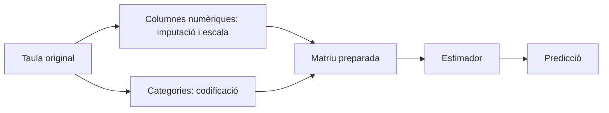

# 06 · Aprenentatge supervisat amb scikit-learn

[← Índex de les píndoles](../index.md)

!!! abstract "Què aprendràs"
    - Separar predictors i objectiu.
    - Comparar una referència simple amb models dins d’un pipeline.
    - Reservar la prova i gestionar entrades noves.

**Coneixements previs:** pandas, funcions i nocions de mitjana i error.

**Dedicació orientativa:** 4–5 h per a lectura i laboratori guiat; les extensions i els exercicis autònoms requerixen temps addicional.

!!! tip "Dos recorreguts possibles"
    **Essencial:** llig els fonaments, executa el laboratori i completa la pràctica inicial. **Aprofundiment:** continua amb les pràctiques intermèdia i avançada i els exercicis. El professorat pot seleccionar-les segons els coneixements previs; no són totes obligatòries dins del projecte.

## Mapa de la unitat

Què aprén un model → El contracte de l’estimador → Separar abans de preparar → Dades numèriques i categòriques → Pipeline i ColumnTransformer → Referències, models lineals i arbres → Mètriques i decisions → Llegir el laboratori

## 1. Què aprén un model

En aprenentatge supervisat tenim exemples amb predictors `X` i un resultat `y`. El model ajusta una relació per produir prediccions sobre observacions noves. Ajustar no és memoritzar una fórmula científica de la realitat: el resultat depén de la mostra, les variables, el criteri d’error i les restriccions del model.

La regressió estima una quantitat, com temps de resolució o consum. La classificació estima una classe, com una categoria d’incidència. Una probabilitat de classe, una etiqueta i una quantitat contínua requerixen mètriques i interpretacions diferents.

Scikit-learn oferix una interfície comuna per transformar dades, ajustar estimadors i avaluar-los. La biblioteca no decidix per nosaltres si les observacions són independents, si la variable era coneguda o si la pregunta de negoci té sentit.

## 2. El contracte de l’estimador

`fit(X, y)` ajusta el model. `predict(X_nou)` calcula resultats amb allò que ja ha aprés. Un transformador també pot oferir `transform`; `fit_transform` combina aprendre una regla i aplicar-la sobre les dades d’ajust.

```python title="Una regressió mínima i les seues dimensions"
import numpy as np
from sklearn.linear_model import LinearRegression

X = np.array([[1.], [2.], [3.], [4.]])
y = np.array([3., 5., 7., 9.])
model = LinearRegression().fit(X, y)
print(model.predict(np.array([[5.]])))  # Aproximadament 11.
```

`X` té files d’observacions i columnes de predictors. `y` ha de correspondre a les mateixes files. Este exemple demostra l’API, no valida un sistema predictiu: quatre punts perfectament lineals no representen la variabilitat d’un problema real.

## 3. Separar abans de preparar

Cal reservar dades abans de triar variables, imputacions o models orientats a predicció. Entrenament servix per ajustar; validació, per decidir; prova, per estimar el resultat final una vegada fixades les decisions.

El laboratori usa habitatges sintètics generats independentment. Per això una partició aleatòria és coherent amb el seu disseny. Si diverses files corresponen a una mateixa persona, edifici o període, s’ha de considerar una separació per grups o temps. Copiar `train_test_split` sense revisar la unitat d’observació és un error metodològic.

No s’ha d’ajustar la mediana d’imputació sobre tot el dataset. Les transformacions aprenen propietats de les dades; també poden introduir fuga d’informació. La guia oficial de [problemes habituals](https://scikit-learn.org/stable/common_pitfalls.html) mostra com els pipelines ajuden a mantindre esta separació.

## 4. Dades numèriques i categòriques

Una variable numèrica pot requerir imputació i escala. Una categoria no es convertix necessàriament en una magnitud assignant-li 0, 1 i 2: el model podria interpretar una distància o ordre inexistents.

`OneHotEncoder` crea indicadors per categoria. `handle_unknown='ignore'` permet processar categories no vistes sense interrompre la predicció, però no significa que el model les entenga. La representació resultant pot ser ambigua respecte de categories conegudes i s’ha de monitorar.

`StandardScaler` centra i escala amb estadístics d’entrenament. És rellevant en regularització i distàncies; molts arbres no necessiten l’escala per fer particions. Utilitzar el mateix preprocessament en una comparació didàctica pot simplificar-la, però convé explicar quina part necessita cada model.

## 5. Pipeline i ColumnTransformer

Un `Pipeline` encadena passos: preparació seguida d’estimador. Quan el model es valida en diverses particions, cada ajust aprén les transformacions sobre la part d’entrenament corresponent. Un `ColumnTransformer` aplica operacions distintes a grups de columnes.



Guardar només els coeficients finals i oblidar la preparació trenca el contracte d’inferència. La mateixa fila ha de transformar-se amb les mateixes regles durant entrenament i ús posterior.

## 6. Referències, models lineals i arbres

Un model constant, com la mitjana, és una baseline útil: indica què s’aconseguix sense aprofitar predictors. Un model que no millora la referència pot necessitar millors dades, una pregunta diferent o una revisió del procediment.

Ridge és una regressió lineal amb penalització sobre la mida dels coeficients. El paràmetre `alpha` controla la força de la regularització. Penalitzar pot reduir variància i estabilitzar coeficients, però massa penalització també pot impedir capturar relacions útils.

Un arbre partix l’espai de variables segons regles. Un bosc aleatori combina molts arbres per reduir dependència d’una única partició. `min_samples_leaf` limita fulles massa petites. El model pot captar interaccions, però això no garantix una millora sobre una relació aproximadament lineal.

## 7. Mètriques i decisions

MAE expressa error absolut mitjà en la unitat del resultat. RMSE penalitza més els errors grans. R² compara amb una referència basada en la mitjana del conjunt avaluat i pot ser negatiu. Cap mètrica és un certificat universal de qualitat.

En classificació, distingix precisió, sensibilitat i F1; en classes descompensades, l’exactitud pot resultar enganyosa. No trasllades ROC/AUC o una matriu de confusió a un problema d’unitats contínues sense haver definit una classificació real.

Compara sobre les mateixes files i amb criteris fixats abans. Si tries el model amb la prova i després cites eixa mètrica com a independent, estàs reutilitzant l’examen per estudiar.

## 8. Llegir el laboratori

El programa genera consum a partir de superfície, aïllament i soroll. Introduïx absències en superfície, compara una referència, ridge i bosc, tria en validació i avalua la decisió en prova. També envia una categoria nova per observar el comportament del codificador.

La pregunta final no és «quin algorisme guanya sempre?», sinó «què ens permet afirmar esta comparació?». Les dades són sintètiques, la relació de partida és simple i el resultat no identifica la millor tecnologia per a qualsevol problema energètic.

Per ampliar, exporta la taula d’experiments i estudia estabilitat amb altres mostres d’entrenament, sense canviar contínuament el test. Registra també temps, variables i decisions; una millora mínima pot no justificar un manteniment molt més complex.

## Laboratori complet i reproduïble

**Context:** treballarem amb dades sintètiques creades pel mateix programa. No cal descarregar datasets ni usar els CSV de BiciTierra. Els valors servixen per aprendre i comprovar procediments; no descriuen una població real.

**Materials:** Python 3.10 o superior, un entorn virtual i els [requisits de la unitat](requirements.txt). Consulta la [preparació comuna](../index.md) abans d’instal·lar-los.

Des de la carpeta d’esta píndola, amb l’entorn activat:

```bash
python -m pip install -r requirements.txt
python codi/exemple.py
```

El programa crea `codi/eixides/`. Pots examinar les eixides sense modificar el codi original. Per resoldre les variants, treballa sobre una còpia i actualitza les comprovacions quan canvies deliberadament les dades.

### Exemple comentat

[Obri o descarrega el programa complet](codi/exemple.py). Cada comprovació `assert` expressa una propietat esperada de les dades de demostració; si falla, investiga la causa abans d’eliminar-la.

```python title="codi/exemple.py" linenums="1"
"""Regressió sobre observacions independents sintètiques, no una sèrie temporal."""
from pathlib import Path
import numpy as np
import pandas as pd
from sklearn.compose import ColumnTransformer
from sklearn.impute import SimpleImputer
from sklearn.preprocessing import OneHotEncoder, StandardScaler
from sklearn.pipeline import Pipeline
from sklearn.linear_model import Ridge
from sklearn.ensemble import RandomForestRegressor
from sklearn.dummy import DummyRegressor
from sklearn.model_selection import train_test_split
from sklearn.metrics import mean_absolute_error

def main():
    rng = np.random.default_rng(12)
    X = pd.DataFrame({'superficie': rng.uniform(40, 180, 480), 'aillament': rng.choice(['baix', 'alt'], 480)})
    y = 12 + 0.4 * X.superficie + 18 * (X.aillament == 'baix') + rng.normal(0, 5, len(X))
    X.loc[rng.choice(len(X), 20, replace=False), 'superficie'] = np.nan
    (train, test, yt, ytest) = train_test_split(X, y, test_size=0.2, random_state=42)
    (train, valid, yt, yv) = train_test_split(train, yt, test_size=0.25, random_state=42)

    def make(estimator):
        # La imputació i l’escala s’ajusten dins del pipeline, només amb entrenament.
        numeric = Pipeline([('impute', SimpleImputer(strategy='median')), ('scale', StandardScaler())])
        prep = ColumnTransformer([('num', numeric, ['superficie']), ('cat', OneHotEncoder(handle_unknown='ignore', sparse_output=False), ['aillament'])])
        return Pipeline([('prep', prep), ('model', estimator)])
    candidates = {'dummy': make(DummyRegressor()), 'ridge': make(Ridge(alpha=1)), 'forest': make(RandomForestRegressor(n_estimators=80, min_samples_leaf=5, random_state=42, n_jobs=1))}
    metrics = {}
    for (name, model) in candidates.items():
        model.fit(train, yt)
        metrics[name] = mean_absolute_error(yv, model.predict(valid))
    # La selecció usa exclusivament validació; la prova es consulta després.
    chosen = min(metrics, key=metrics.get)
    print('MAE validació:', metrics)
    print('Triat:', chosen)
    print('MAE test reservat:', mean_absolute_error(ytest, candidates[chosen].predict(test)))
    assert min(metrics.values()) < metrics['dummy']
    out = Path(__file__).resolve().parent / 'eixides'
    out.mkdir(exist_ok=True)
    pd.DataFrame({'real': ytest, 'prediccio': candidates[chosen].predict(test)}).to_csv(out / 'prova.csv', index=False)
    print('Categoria nova:', candidates[chosen].predict(pd.DataFrame({'superficie': [85.0], 'aillament': ['mitja']})))
if __name__ == '__main__':
    main()
```

## Pràctiques guiades

Cada pràctica deixa una evidència petita: una eixida comprovada i una explicació de la decisió. Els temps són orientatius i no inclouen instal·lació.

### Pràctica 1 · Entendre el contracte de predicció

**Nivell i temps:** Inicial · 20–30 min.

**Objectiu:** Identificar objectiu, predictors i particions abans d’ajustar.

**Materials:** exemple comentat d’esta unitat, les seues eixides i una còpia de treball per a les modificacions.

**Procediment:**

1. Executa el laboratori i localitza les 480 observacions sintètiques.
2. Calcula les mides de les particions després dels dos repartiments: entrenament, validació i prova.
3. Dibuixa el recorregut des de les columnes originals fins a la predicció del pipeline.
4. Explica per què el repartiment aleatori és acceptable en esta simulació independent, però no es trasllada automàticament a una sèrie temporal.

!!! success "Comprovació i evidència esperada"
    Identifiques 288, 96 i 96 files i distingixes superfície i aïllament de la resposta.

**Preguntes de reflexió:**

- Què aprendria el DummyRegressor?
- Quina informació hauria d’estar disponible quan demanem una predicció?
- Per què la resposta no pot entrar en el preprocessament de predictors?

**Ampliació opcional:** Calcula la distribució de categories en cada partició sense usar-la per retocar la prova.

### Pràctica 2 · Comparar amb una referència

**Nivell i temps:** Intermèdia · 30–45 min.

**Objectiu:** Seleccionar una alternativa segons validació i documentar la decisió.

**Materials:** exemple comentat d’esta unitat, les seues eixides i una còpia de treball per a les modificacions.

**Procediment:**

1. Registra el MAE de dummy, Ridge i bosc sobre validació.
2. Relaciona cada model amb una hipòtesi sobre la forma de la relació entre entrades i resposta.
3. Tria segons el criteri declarat pel programa i compara la millora respecte de dummy en unitats de consum.
4. Consulta la prova una vegada i redacta una conclusió que distingisca selecció i estimació final.

!!! success "Comprovació i evidència esperada"
    La taula conserva els tres candidats; el model seleccionat millora dummy en este exemple, sense generalitzar que sempre ho farà.

**Preguntes de reflexió:**

- Per què guanyar en entrenament no basta?
- Quina diferència entre dos MAE seria rellevant en l’ús previst?
- Què faries si tots els models empitjoraren la referència?

**Ampliació opcional:** En una nova exploració amb una nova reserva de prova, compara dos valors d’alpha i registra les decisions prèviament.

### Pràctica 3 · Entrades incompletes o desconegudes

**Nivell i temps:** Avançada · 45–60 min.

**Objectiu:** Comprovar el comportament del pipeline davant de casos d’ús.

**Materials:** exemple comentat d’esta unitat, les seues eixides i una còpia de treball per a les modificacions.

**Procediment:**

1. Localitza els valors absents de superfície i la imputació dins del pipeline.
2. Prediu per a una superfície absent amb aïllament conegut.
3. Examina el cas `aillament="mitja"` que no apareix en entrenament i l’efecte de `handle_unknown="ignore"`.
4. Proposa un control d’entrada que avise de categories noves i un procediment per decidir si cal incorporar-les a les dades.

!!! success "Comprovació i evidència esperada"
    El codi pot produir una xifra, però l’informe diferencia compatibilitat tècnica d’evidència suficient per confiar-hi.

**Preguntes de reflexió:**

- Amb quines files s’ha ajustat la mediana?
- Per què ignorar una categoria nova no equival a haver-la aprés?
- Quin canvi de població podria invalidar el model?

**Ampliació opcional:** Defineix límits plausibles de superfície i prova un cas fora del domini sense presentar-lo com una predicció fiable.

## Exercicis autònoms

Intenta resoldre cada repte abans de desplegar l’orientació. Es valora el raonament i les comprovacions, no només obtindre una xifra.

### Repte 1 · Una nova referència

Compara DummyRegressor amb mitjana i mediana sobre la mateixa validació.

??? example "Solució orientativa i criteri de revisió"
    Amb MAE, la mediana és una referència natural. Compara dades i partició idèntiques; no dones per fet que l’avantatge teòric sobre entrenament implique una diferència gran en validació.

### Repte 2 · Classificació

Reformula un problema com predir si una incidència superarà un termini conegut i definix objectiu i predictors disponibles.

??? example "Solució orientativa i criteri de revisió"
    L’etiqueta es calcula després de conéixer el desenllaç; les entrades han de ser les disponibles en obrir la incidència. No uses durada final ni data de resolució com a predictors.

### Repte 3 · Fuga subtil

Explica per què calcular la mediana sobre totes les files abans de repartir-les és problemàtic.

??? example "Solució orientativa i criteri de revisió"
    El preprocessament utilitza informació de validació i prova. Ajusta la mediana només amb entrenament dins del pipeline i aplica eixa mateixa transformació als altres blocs.

## Errors habituals i diagnòstic

| Símptoma | Causa que convé investigar | Comprovació o correcció |
|---|---|---|
| Validació sorprenentment perfecta | Possible fuga o duplicats entre blocs. | Audita variables i partició abans de celebrar la mètrica. |
| Predicció incompatible amb les columnes | Preprocessament separat del model. | Usa un pipeline i un esquema d’entrada explícit. |
| Categoria nova sense error però poc fiable | Codificació que ignora desconegudes. | Registra el cas i revisa cobertura d’entrenament. |

## Autoavaluació i evidències

Abans de donar la unitat per treballada, comprova estos punts i escriu una frase d’evidència per a cadascun:

- [ ] Puc separar predictors i objectiu.
- [ ] Puc comparar una referència simple amb models dins d’un pipeline.
- [ ] Puc reservar la prova i gestionar entrades noves.
- [ ] He executat el laboratori i he contrastat almenys un resultat independentment.
- [ ] Puc explicar una limitació i un cas en què el procediment requeriria canvis.

**Lliurable de la píndola:** còpia de treball reproduïble, resultats de la pràctica seleccionada i un text breu que indique pregunta, decisió, comprovació i limitació. Si s’usa dins de BiciTierra Market, integra esta evidència en el lliurable setmanal corresponent; no cal crear una entrega duplicada.

## Fonts per aprofundir

- [Documentació oficial de referència](https://scikit-learn.org/stable/common_pitfalls.html). Consulta especialment els conceptes i els supòsits descrits en la unitat.

Les versions executades i els límits de la comprovació estan en el [registre de validació](../VALIDACIO.md). Els exemples són originals i les dades són sintètiques.

## Aplicació final a BiciTierra Market

**Moment orientatiu:** setmana 3. Esta correspondència ajuda a triar materials i no substituïx el document de treball de l’alumnat.

Construïx una referència de predicció de vendes i un pipeline ajustat només amb el passat disponible. El repartiment aleatori del laboratori d’habitatges no és el disseny adequat per traslladar-lo sense canvis a l’històric mensual; usa la píndola de validació temporal.

**Transferència:** identifica quin concepte acabes de practicar, quina dada del projecte l’exigix i què has de canviar respecte del laboratori. Justifica eixa adaptació abans de copiar codi.
