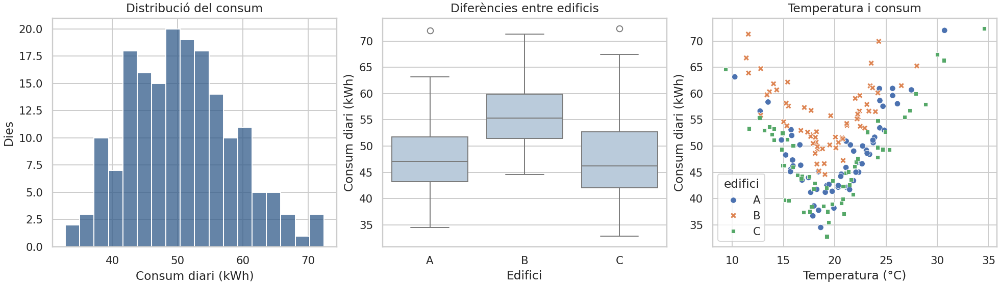

# 05 · Visualització amb Matplotlib i seaborn

[← Índex de les píndoles](../index.md)

!!! abstract "Què aprendràs"
    - Triar gràfics segons la pregunta.
    - Representar distribucions, relacions i grups amb unitats.
    - Distingir dispersió, estimació i incertesa.

**Coneixements previs:** Taules pandas i estadística descriptiva elemental.

**Dedicació orientativa:** 3–4 h per a lectura i laboratori guiat; les extensions i els exercicis autònoms requerixen temps addicional.

!!! tip "Dos recorreguts possibles"
    **Essencial:** llig els fonaments, executa el laboratori i completa la pràctica inicial. **Aprofundiment:** continua amb les pràctiques intermèdia i avançada i els exercicis. El professorat pot seleccionar-les segons els coneixements previs; no són totes obligatòries dins del projecte.

## Mapa de la unitat

La pregunta precedix el gràfic → Figure, Axes i semàntica → Triar una representació → Què està calculant Seaborn? → Escales, color i comparacions justes → Associació, correlació i causalitat → Exportació i verificació → Escriure una interpretació útil

## 1. La pregunta precedix el gràfic

Visualitzar significa representar dades perquè una relació siga llegible. Abans de dibuixar cal decidir quina pregunta es vol respondre, quina és la unitat d’observació i quina comparació té sentit. Un gràfic de consum total pot identificar l’edifici més gran; un de consum per metre quadrat respon una altra pregunta.

Matplotlib proporciona control sobre figures, eixos i elements. Seaborn incorpora funcions orientades a dades tabulars i a representacions estadístiques. Seaborn es construïx sobre Matplotlib, de manera que es poden combinar: crear eixos amb Matplotlib, dibuixar amb Seaborn i ajustar títols, límits o anotacions.

Un mateix conjunt de dades pot necessitar diverses vistes, però afegir gràfics sense una pregunta distinta augmenta el treball de lectura sense aportar evidència. La selecció forma part de l’anàlisi.

## 2. Figure, Axes i semàntica

La `Figure` és el contenidor global i cada `Axes` és una zona on es dibuixen dades. La interfície orientada a objectes fa explícit on s’aplica cada operació i evita modificar per accident «l’eix actual» en informes amb diverses vistes.

```python title="Una figura amb una pregunta concreta"
import matplotlib.pyplot as plt

fig, ax = plt.subplots(figsize=(6, 3))
ax.bar(["Web", "Correu", "VPN"], [12, 18, 7])
ax.set(title="Incidències registrades per servei",
       xlabel="Servei", ylabel="Nombre d’incidències")
fig.tight_layout()
plt.close(fig)
```

En Seaborn, `x` i `y` assignen variables als eixos, `hue` a color i `style` a formes o traç. No totes les funcions accepten les mateixes opcions. Les funcions d’eix, com `scatterplot`, es poden situar en un `ax`; altres, com `relplot`, creen una figura amb la seua pròpia estructura.

## 3. Triar una representació

| Pregunta | Representació habitual | Què cal vigilar |
|---|---|---|
| Com es distribuïx una magnitud? | Histograma o ECDF | Nombre d’intervals, mostra i valors absents |
| Com es comparen distribucions? | Boxplot, violinplot o punts | Mida de grup i extrems |
| Canvia una variable amb una altra? | Dispersió | Solapament, no linealitat i confusors |
| Com evoluciona en el temps? | Línia | Dates ordenades i buits reals |
| Com es comparen totals? | Barres sobre dades agregades | No confondre total, mitjana i freqüència |
| Quines relacions hi ha entre moltes variables? | Matriu de correlació | Associació lineal, nuls i redundància |

Un histograma depén dels intervals; una ECDF mostra la proporció acumulada sense escollir amplada d’interval. Un boxplot resumix quartils i punts segons una regla, però amaga detalls de la forma. En mostres menudes, mostrar els punts pot ser més honest que una densitat suavitzada.

## 4. Què està calculant Seaborn?

Algunes funcions agreguen per defecte. Si `barplot` rep diverses files d’una categoria, la seua altura acostuma a representar un estimador, no un recompte ni una suma. `countplot` compta observacions. Si vols ingressos totals, agrega explícitament i després representa el resultat.

```python title="Agregació explícita abans de dibuixar"
import pandas as pd
import seaborn as sns
import matplotlib.pyplot as plt

df = pd.DataFrame({"servei":["web","web","vpn"],"minuts":[20,40,10]})
totals = df.groupby("servei", as_index=False)["minuts"].sum()
fig, ax = plt.subplots()
sns.barplot(data=totals, x="servei", y="minuts", errorbar=None, ax=ax)
ax.set_ylabel("Minuts totals registrats")
plt.close(fig)
```

Una barra d’error pot representar dispersió de dades o incertesa d’un estimador; no són equivalents. Cal llegir el paràmetre i explicar què s’està mostrant. Amb dades temporals correlacionades, un procediment que tracta totes les files com a independents pot donar una impressió d’incertesa massa baixa. La documentació de [barres d’error de Seaborn](https://seaborn.pydata.org/tutorial/error_bars.html) distingix estes opcions.

## 5. Escales, color i comparacions justes

En barres, començar lluny de zero pot exagerar diferències de longitud. En línies, un rang retallat pot ser útil per veure canvis menuts si s’indica amb claredat. No és una prohibició universal: l’important és que la representació no suggerisca una magnitud incorrecta.

Una escala logarítmica representa proporcions i facilita llegir ordres de magnitud, però no admet directament zero o negatius. Explica la transformació i no l’apliques només perquè «queda millor». En diversos panells, usa límits comparables si es pretén comparar magnituds.

Per a categories, usa colors diferenciables; per a quantitats ordenades, una escala amb progressió perceptiva. Afig formes, etiquetes o patrons quan la informació no haja de dependre només del color. Els títols, unitats i llegendes han de permetre interpretar el gràfic fora del notebook.

## 6. Associació, correlació i causalitat

Una dispersió revela patrons que una correlació pot ocultar. En el laboratori, el consum puja quan la temperatura s’allunya d’un punt moderat: la relació no és una recta. La correlació lineal sola pot resumir-la malament.

També hi ha diferències entre edificis. Si s’ignoren, es pot atribuir a temperatura allò que està relacionat amb mida o ús de l’edifici. Dividir per grups, mostrar distribucions i revisar denominadors ajuda a formular preguntes, però no transforma un estudi observacional en un experiment causal.

Una línia de regressió és una descripció d’un model, no una demostració que modificar l’eix X produïsca el canvi representat en Y. Escriu conclusions com «en esta mostra observem» i especifica les variables no controlades.

## 7. Exportació i verificació

PNG és pràctic per a imatges; SVG conserva elements vectorials adequats per ampliar-los. Un gràfic amb molts punts pot generar un SVG molt pesat. Tria segons l’ús, la mida i la necessitat d’edició.

Guarda amb una resolució adequada, comprova el fitxer fora del notebook i tanca figures quan generes informes repetits. Revisa textos tallats, contrast i unitats. Una figura sense errades de codi pot continuar sent impossible de llegir.

El laboratori produïx tres vistes sobre 180 dies sintètics de consum: distribució, comparació per edifici i relació amb temperatura. Cada vista respon una pregunta distinta. Els CSV i les figures es generen localment, sense descàrregues.

## 8. Escriure una interpretació útil

Per a cada figura, escriu què representa, quin patró s’observa, quina comprovació el sustenta i quina conclusió no es pot extraure. Per exemple, una mitjana superior en un edifici pot justificar una auditoria, però no permet afirmar una ineficiència sense conéixer superfície i ocupació.

Una bona revisió gràfica contrasta el dibuix amb els totals originals. Si una categoria desapareix, comprova nuls, filtres i agrupacions abans d’atribuir-ho a un fenomen real.

## Laboratori complet i reproduïble

**Context:** treballarem amb dades sintètiques creades pel mateix programa. No cal descarregar datasets ni usar els CSV de BiciTierra. Els valors servixen per aprendre i comprovar procediments; no descriuen una població real.

**Materials:** Python 3.10 o superior, un entorn virtual i els [requisits de la unitat](requirements.txt). Consulta la [preparació comuna](../index.md) abans d’instal·lar-los.

Des de la carpeta d’esta píndola, amb l’entorn activat:

```bash
python -m pip install -r requirements.txt
python codi/exemple.py
```

El programa crea `codi/eixides/`. Pots examinar les eixides sense modificar el codi original. Per resoldre les variants, treballa sobre una còpia i actualitza les comprovacions quan canvies deliberadament les dades.

### Exemple comentat

[Obri o descarrega el programa complet](codi/exemple.py){ download="exemple.py" }. Cada comprovació `assert` expressa una propietat esperada de les dades de demostració; si falla, investiga la causa abans d’eliminar-la.

```python title="codi/exemple.py" linenums="1"
"""Informe gràfic local; no descarrega datasets."""
from pathlib import Path
import numpy as np
import pandas as pd
import matplotlib
matplotlib.use('Agg')
import matplotlib.pyplot as plt
import seaborn as sns

def main():
    # La llavor fixa fa repetible esta simulació docent.
    rng = np.random.default_rng(42)
    df = pd.DataFrame({'temperatura': rng.normal(20, 5, 180), 'edifici': np.repeat(['A', 'B', 'C'], 60)})
    df['kwh'] = 40 + 2.5 * abs(df.temperatura - 19) + df.edifici.map({'A': 0, 'B': 8, 'C': -3}) + rng.normal(0, 3, len(df))
    sns.set_theme(style='whitegrid')
    (fig, axes) = plt.subplots(1, 3, figsize=(14, 4), layout='constrained')
    sns.histplot(data=df, x='kwh', bins=18, ax=axes[0], color='#315b8a')
    sns.boxplot(data=df, x='edifici', y='kwh', ax=axes[1], color='#b5cbe0')
    sns.scatterplot(data=df, x='temperatura', y='kwh', hue='edifici', style='edifici', ax=axes[2])
    axes[0].set(xlabel='Consum diari (kWh)', ylabel='Dies', title='Distribució del consum')
    axes[1].set(xlabel='Edifici', ylabel='Consum diari (kWh)', title='Diferències entre edificis')
    axes[2].set(xlabel='Temperatura (°C)', ylabel='Consum diari (kWh)', title='Temperatura i consum')
    out = Path(__file__).resolve().parent / 'eixides'
    out.mkdir(exist_ok=True)
    # Exportem abans de tancar per conservar tots els elements de la figura.
    fig.savefig(out / 'energia.png', dpi=140)
    # Exportem abans de tancar per conservar tots els elements de la figura.
    fig.savefig(out / 'energia.svg')
    plt.close(fig)
    df.to_csv(out / 'energia.csv', index=False)
    assert (out / 'energia.png').stat().st_size > 1000
    print(df.groupby('edifici').kwh.agg(['count', 'mean', 'median']).round(2).to_string())
if __name__ == '__main__':
    main()
```



*Figura generada pel programa: dades sintètiques, 60 observacions per edifici.*

## Pràctiques guiades

Cada pràctica deixa una evidència petita: una eixida comprovada i una explicació de la decisió. Els temps són orientatius i no inclouen instal·lació.

### Pràctica 1 · Tres preguntes, tres gràfics

**Nivell i temps:** Inicial · 20–30 min.

**Objectiu:** Identificar què mostra cada representació del laboratori.

**Materials:** exemple comentat d’esta unitat, les seues eixides i una còpia de treball per a les modificacions.

**Procediment:**

1. Executa l’exemple i obri `energia.png` i la taula de dades generada.
2. Escriu una pregunta específica per a histograma, boxplot i dispersió.
3. Comprova unitats, recompte de 180 observacions i els 60 registres de cada edifici.
4. Redacta una observació descriptiva per gràfic sense formular una explicació causal.

!!! success "Comprovació i evidència esperada"
    El relat diferencia distribució de consum, comparació de grups i relació entre temperatura i consum.

**Preguntes de reflexió:**

- Per què el boxplot no mostra cada dia individual?
- Quina informació conserva el diagrama de dispersió que perd una mitjana?
- Quina afirmació causal seria excessiva?

**Ampliació opcional:** Afig punts amb transparència sobre el boxplot per mostrar la mida i dispersió dels grups.

### Pràctica 2 · Com les decisions visuals canvien la lectura

**Nivell i temps:** Intermèdia · 30–45 min.

**Objectiu:** Examinar sensibilitat a intervals i escales.

**Materials:** exemple comentat d’esta unitat, les seues eixides i una còpia de treball per a les modificacions.

**Procediment:**

1. Fes dues versions de l’histograma, amb 6 i 30 intervals.
2. Mantín les mateixes dades, unitats i límits per comparar només la discretització.
3. Representa el consum per edifici amb una mitjana i amb una distribució completa.
4. Anota quines diferències semblen més o menys visibles i quin gràfic respon millor a cada pregunta.

!!! success "Comprovació i evidència esperada"
    Les conclusions reconeixen que els intervals alteren l’aparença i que una mitjana amaga dispersió.

**Preguntes de reflexió:**

- Què podria semblar un segon pic només per l’elecció dels intervals?
- Per què un eix truncat és problemàtic en barres?
- Quan resulta útil mostrar la mediana?

**Ampliació opcional:** Ordena els edificis per mediana i comprova que les etiquetes continuen coincidint amb els grups.

### Pràctica 3 · Una figura que es puga compartir

**Nivell i temps:** Avançada · 45–60 min.

**Objectiu:** Preparar una eixida llegible i una interpretació amb límits.

**Materials:** exemple comentat d’esta unitat, les seues eixides i una còpia de treball per a les modificacions.

**Procediment:**

1. Crea una figura individual de temperatura i consum amb títol, unitats, llegenda i peu que indique dades sintètiques.
2. Usa color i forma per diferenciar edificis; revisa la lectura en escala de grisos.
3. Exporta en PNG i SVG i comprova que no es retallen títols o llegendes.
4. Acompanya-la d’un text de 80–120 paraules que descriga patró, diferències i limitació.

!!! success "Comprovació i evidència esperada"
    La figura es pot entendre sense llegir el programa i el text no promet capacitat predictiva no avaluada.

**Preguntes de reflexió:**

- Quina informació mínima necessita una persona externa?
- Per què una banda de dispersió no equival a un interval de confiança?
- Quin format triaries per inserir la figura en un document ampliable?

**Ampliació opcional:** Crea una segona figura amb residus d’una recta i examina si queda un patró sistemàtic.

## Exercicis autònoms

Intenta resoldre cada repte abans de desplegar l’orientació. Es valora el raonament i les comprovacions, no només obtindre una xifra.

### Repte 1 · Triar el gràfic

Tria representació per a evolució mensual, distribució de temps i comparació de categories. Justifica cada elecció.

??? example "Solució orientativa i criteri de revisió"
    Línia amb dates ordenades per a evolució, histograma o distribució per a temps, barres o punts per a categories. Inclou unitats i mida de grup quan afecte la lectura.

### Repte 2 · Barres d’error

Explica què voldries mostrar amb desviació estàndard i amb interval de confiança de la mitjana.

??? example "Solució orientativa i criteri de revisió"
    La desviació descriu dispersió d’observacions; l’interval descriu incertesa d’una estimació sota un procediment i supòsits. No es poden intercanviar només perquè produïxen bandes semblants.

### Repte 3 · Crítica visual

Crea una versió deliberadament deficient d’una figura i després corregix tres problemes.

??? example "Solució orientativa i criteri de revisió"
    Pots ometre unitats, usar colors indistingibles o un títol ambigu. La correcció ha d’explicar com cada canvi ajuda a interpretar dades; afegir decoració no és suficient.

## Errors habituals i diagnòstic

| Símptoma | Causa que convé investigar | Comprovació o correcció |
|---|---|---|
| Figura buida o incompleta | Guardat en un moment incorrecte o eixos equivocats. | Usa fig.savefig abans de tancar la figura i passa ax explícitament. |
| Colors difícils de distingir | Dependència exclusiva del color. | Afig formes, etiquetes i contrast. |
| Conclusions diferents amb els mateixos valors | Escales, agregació o intervals diferents. | Mantín escales comparables i mostra dades o dispersió. |

## Autoavaluació i evidències

Abans de donar la unitat per treballada, comprova estos punts i escriu una frase d’evidència per a cadascun:

- [ ] Puc triar gràfics segons la pregunta.
- [ ] Puc representar distribucions, relacions i grups amb unitats.
- [ ] Puc distingir dispersió, estimació i incertesa.
- [ ] He executat el laboratori i he contrastat almenys un resultat independentment.
- [ ] Puc explicar una limitació i un cas en què el procediment requeriria canvis.

**Lliurable de la píndola:** còpia de treball reproduïble, resultats de la pràctica seleccionada i un text breu que indique pregunta, decisió, comprovació i limitació. Si s’usa dins de BiciTierra Market, integra esta evidència en el lliurable setmanal corresponent; no cal crear una entrega duplicada.

## Fonts per aprofundir

- [Documentació oficial de referència](https://seaborn.pydata.org/tutorial/error_bars.html). Consulta especialment els conceptes i els supòsits descrits en la unitat.

Les versions executades i els límits de la comprovació estan en el [registre de validació](../VALIDACIO.md). Els exemples són originals i les dades són sintètiques.

## Aplicació final a BiciTierra Market

**Moment orientatiu:** setmana 2, 4 i 6. Esta correspondència ajuda a triar materials i no substituïx el document de treball de l’alumnat.

Usa evolució mensual i distribucions en l’exploració, comparacions de perfils en segmentació i figures finals amb unitats i data de tall. Les vendes totals i les vendes d’una combinació concreta responen preguntes diferents: fes visible el nivell d’agregació.

**Transferència:** identifica quin concepte acabes de practicar, quina dada del projecte l’exigix i què has de canviar respecte del laboratori. Justifica eixa adaptació abans de copiar codi.
